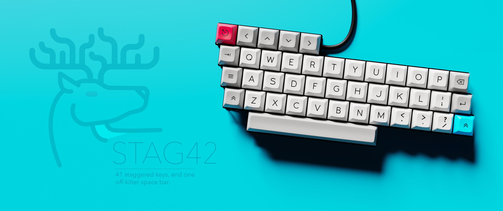
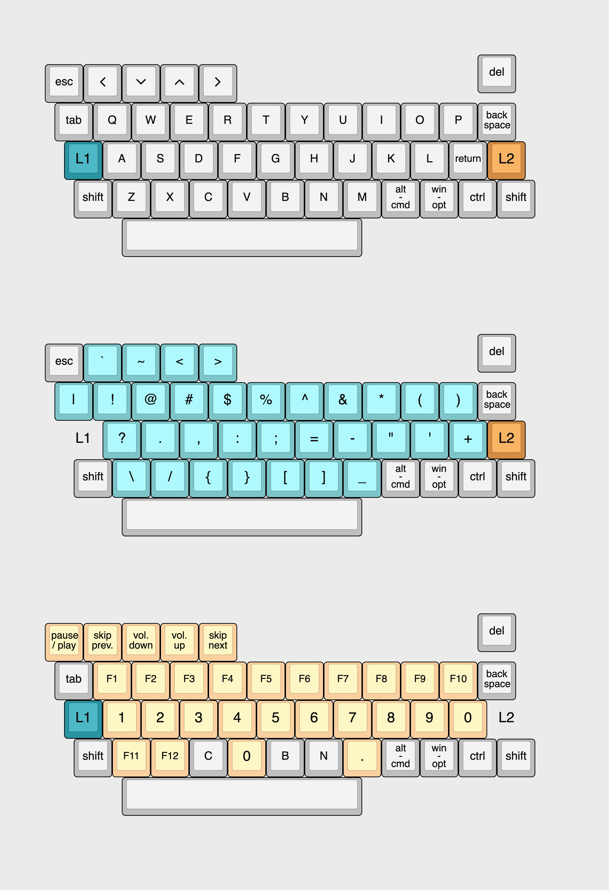

# Stag42
Public repo for the [RedRedRed Stag42](https://redredred.ca/stag42) mechanical keyboard

## Default Layout

The default layout isn't intended to be optimal, rather serving a familiar jumping-off point for people new to small keyboards. For a general introduction to the function of multi-layer keyboards check out TVK's (excellent) [guide](https://thevankeyboards.com/wdamkg). 

Further customization is encouraged. 
